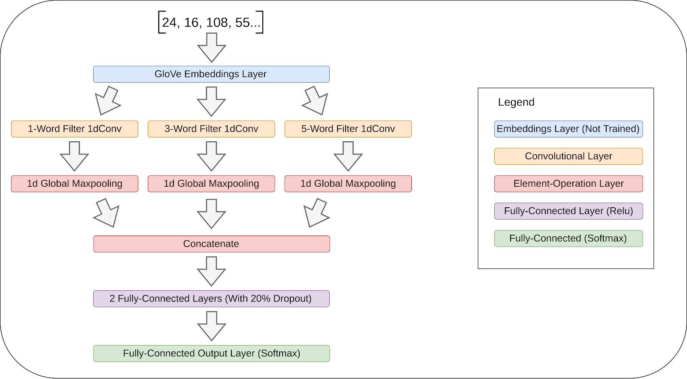

# Fake News Detector

## Basic Information
This project for EECE 5642 Data Visualization attempts to portray the important words in fake news articles to a user, allowing them to learn about the medium and avoid such news in the future. It does this using two main features: a convolutional neural network that operates on the words in the article to determine a news classification, and a Google Chrome extension that accesses this model, classifies text, and changes text sizes to identify which words/phrases the model finds important to the user.

The report for this project is included as `Data_Vis_Final_Project_Report.pdf`.

### Neural Network
The structure for the neural network used can be seen below:

The model is exported in the `model5/` directory, so that it can be imported into the Google Chrome extension.

### Extension
The extension source is contained in the `extension/src/` directory. To build the extension, navigate into `extension/`, then run `yarn && yarn build`. The resulting extension will be packed and available in the `dist/` directory that is created. To use the extension, follow the instructions [Here](https://developer.chrome.com/extensions/getstarted). In short - navigate to `chrome://extensions`, make sure the "Developer Mode" switch is turned on, and click `Load Unpacked`. Select the `dist/` directory, and this will enable the extension in your browser~

To use the extension, navigate to a page you want to classify, and select the article's text. Then, right-click the text, and select the `Classify News Text` option.
